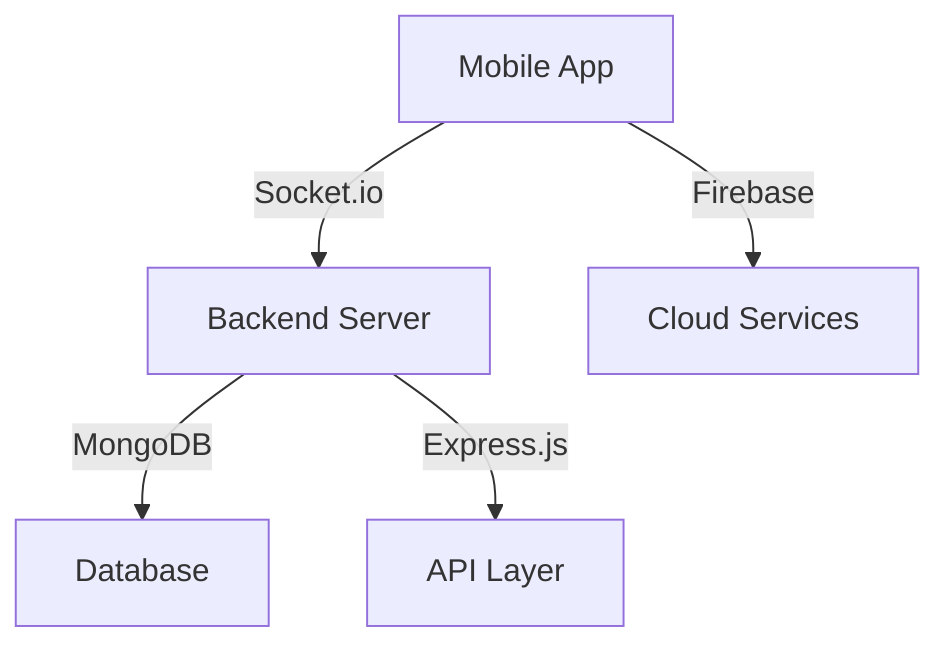

# SocialGo 💝
### Where Meaningful Connections Begin with Mystery

SocialGo reimagines online dating by prioritizing personality over pictures, featuring a unique 24-hour anonymous chat period that leads to more authentic connections.

[](#tech-stack)
[](#features)
[](#tech-stack)

## What Makes Us Different ✨

- **24-Hour Mystery Chat**: Connect deeply before revealing identities
- **One Match at a Time**: Focus on building meaningful connections
- **Discovery Over Scrolling**: Interactive features that encourage active participation
- **Real-time Interactions**: Instant messaging and live notifications
- **Privacy First**: Secure and anonymous initial interactions

## Features

### Core Experience 🎯
- **Anonymous Chat Period**: 24-hour getting-to-know-you phase
- **Identity Reveal**: Synchronized profile reveal after 24 hours
- **Focus Mode**: Single active match system
- **Profile Customization**: Express yourself authentically
- **Smart Matching**: Algorithm-driven compatibility suggestions

### Interactive Elements 🎮
- **Ice Breakers**: Guided conversation starters
- **Mini Games**: Interactive ways to know your match
- **Shared Experiences**: Virtual date suggestions
- **Moment Sharing**: Share interests and activities
- **Connection Timeline**: Track your journey together

### Security & Privacy 🔒
- **Verified Profiles**: User verification system
- **Report System**: Community safety tools
- **Privacy Controls**: Customizable privacy settings
- **Secure Chat**: End-to-end encrypted messaging
- **Data Protection**: Advanced security measures

## Tech Stack

### Frontend
- **Flutter**: Cross-platform mobile development
- **Figma**: UI/UX design
- **Firebase**: Authentication & cloud storage

### Backend
- **Node.js**: Server runtime
- **Express.js**: Web framework
- **Socket.io**: Real-time communication
- **MongoDB**: Database
- **Cloud Services**: Scalable infrastructure

## Getting Started

1. Clone the repository
```bash
git clone https://github.com/shivprasadrahulwad/socialgo.git
```

2. Install dependencies
```bash
cd socialgo
flutter pub get
npm install
```

3. Configure environment variables
```bash
cp .env.example .env
```

4. Start the development servers
```bash
# Backend
npm run dev

# Frontend
flutter run
```

## Environment Setup

### Prerequisites
- Flutter SDK
- Node.js (v14 or higher)
- MongoDB
- Firebase account
- Socket.io

## Architecture



## Contributing

We welcome contributions! Please follow these steps:

1. Fork the Project
2. Create your Feature Branch (`git checkout -b feature/AmazingFeature`)
3. Commit your Changes (`git commit -m 'Add some AmazingFeature'`)
4. Push to the Branch (`git push origin feature/AmazingFeature`)
5. Open a Pull Request

## Future Roadmap 🚀

- [ ] Voice messages during anonymous chat
- [ ] AI-powered compatibility suggestions
- [ ] Virtual date experiences
- [ ] Group activities and events
- [ ] International expansion

## License

This project is licensed under the MIT License - see the [LICENSE.md](LICENSE.md) file for details.

## Contact

Project Link: [https://github.com/shivprasadrahulwad/socialgo](https://github.com/shivprasadrahulwad/socialgo)

---

<div align="center">
Made with ❤️ by Shivprasad Rahulwad
</div>
